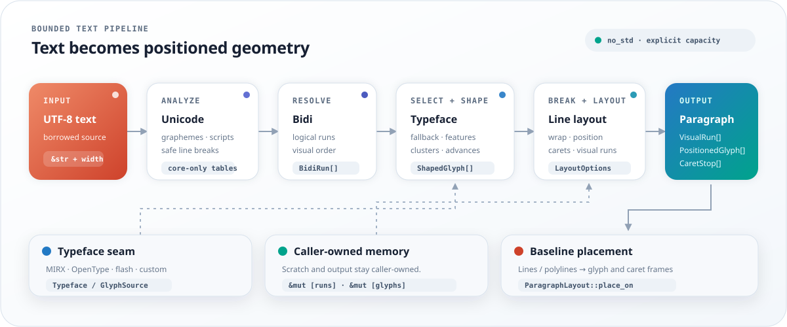

<div align="center">
  

  <p><strong>Bounded Unicode text layout and shaping for Rust</strong></p>

  <p><code>no_std</code> by default · caller-owned memory · renderer-neutral</p>

  <p>
    <a href="https://crates.io/crates/textflow-rs"></a>
    <a href="https://docs.rs/textflow-rs"></a>
    <a href="LICENSE"></a>
    <a href="#feature-flags"></a>
    <a href="Cargo.toml"></a>
  </p>

  <p>
    <a href="#demo">Demo</a>
    · <a href="https://docs.rs/textflow-rs">API</a>
    · <a href="#feature-flags">Features</a>
    · <a href="https://crates.io/crates/textflow-rs">Crate</a>
  </p>
</div>

---

`TextFlow` provides line breaking, bidirectional text, glyph shaping, font fallback, visual runs, and caret positioning. Caller-owned buffers make memory use explicit, while the optional `alloc` feature provides a reusable fixed-capacity workspace over the same algorithms.

<p align="center">
  
</p>

## Demo

```rust
use textflow::TextFlow;

let text = "A small UI can still set type well.";
let lines = TextFlow::new(text, 12)
    .map(|line| line.text())
    .collect::<Vec<_>>();

assert_eq!(lines, ["A small UI", "can still", "set type", "well."]);
```

## Text layout and shaping

- `#![no_std]` by default with a `core`-only runtime.
- Caller-owned buffers with explicit capacity and unsupported-text errors.
- Format-neutral `Typeface` and `GlyphSource` interfaces for TTF, OpenType, MIRX, flash-backed assets, and application-specific font stores.
- Stable glyph IDs, UTF-8 cluster ranges, visual bidi runs, safe line boundaries, and caret positions.
- Optional reusable heap workspace with admission limits and no growth during layout.

## Feature flags

| Feature | Adds |
| --- | --- |
| `unicode` | Bounded grapheme, line-break, and script classification |
| `bidi` | Caller-buffer bidirectional paragraph resolution |
| `shaping` | Format-neutral shaping, fallback, line selection, and positioned output |
| `alloc` | Reusable owning workspace for the shaping pipeline |

Default features are empty. The current Unicode and shaping implementation intentionally supports a defined subset and returns capability errors for unsupported scripts, controls, clusters, and font features.

## Font integration

A format adapter supplies `Typeface` for complete shaping or `GlyphSource` for scalar cmap, advance, `.notdef`, and pair-kerning access, together with its parser, table cache, raster lookup, storage access, and diagnostics.

## Documentation

- [API documentation](https://docs.rs/textflow-rs)
- [Source repository](https://github.com/W-Mai/textflow)

## License

[MIT](LICENSE)
