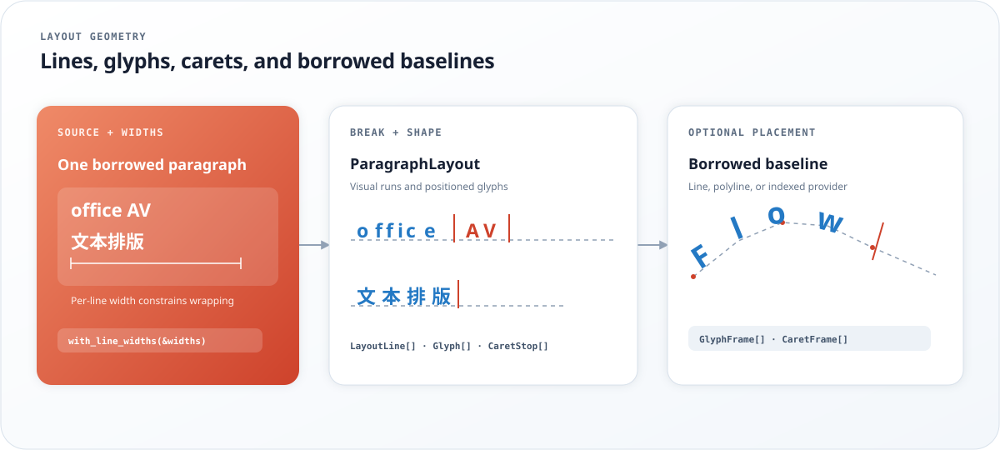

<div align="center">
  

  <p><strong>Bounded Unicode text layout and shaping for Rust</strong></p>

  <p><code>no_std</code> by default · caller-owned memory · renderer-neutral</p>

  <p>
    <a href="https://crates.io/crates/textflow-rs"></a>
    <a href="https://docs.rs/textflow-rs"></a>
    <a href="LICENSE"></a>
    <a href="#feature-flags"></a>
    <a href="Cargo.toml"></a>
  </p>

  <p>
    <a href="#demo">Demo</a>
    · <a href="#playground">Playground</a>
    · <a href="https://docs.rs/textflow-rs">API</a>
    · <a href="#embedded-footprint">Embedded</a>
    · <a href="#used-by">Used by</a>
    · <a href="#feature-flags">Features</a>
    · <a href="https://crates.io/crates/textflow-rs">Crate</a>
  </p>
</div>

---

`TextFlow` provides line breaking, bidirectional text, glyph shaping, font fallback, visual runs, and caret positioning. Caller-owned buffers make memory use explicit, while the optional `alloc` feature provides a bounded workspace that grows private pipeline storage on demand and reuses it.

<p align="center">
  
</p>

<p align="center">
  
</p>

## Used by

[mirui](https://github.com/W-Mai/mirui) uses TextFlow for bounded Unicode analysis, shaping, line layout, and caret placement with MIRX and OpenType font sources across software, GPU, and web renderers.

## Demo

```rust
use textflow::TextFlow;

let text = "A small UI can still set type well.";
let lines = TextFlow::new(text, 12)
    .map(|line| line.text())
    .collect::<Vec<_>>();

assert_eq!(lines, ["A small UI", "can still", "set type", "well."]);
```

Enable `shaping` and pass a font adapter implementing `Typeface` for positioned text:

```rust
use textflow::{LayoutError, LayoutScratch, TextFlow, WrapMode};
use textflow::shaping::Typeface;

fn print_positions(font: &dyn Typeface) -> Result<(), LayoutError> {
    let text = "שלום, hello";
    let mut scratch = LayoutScratch::<16, 64, 8, 128>::new();
    let layout = TextFlow::new(text, 4800)
        .with_line_height(1200)
        .with_wrap(WrapMode::WordOrGrapheme)
        .layout_with_scratch(&[font], &mut scratch)?;

    for glyph in layout.glyphs() {
        let bytes = glyph.cluster.start as usize..glyph.cluster.end as usize;
        let ink = (glyph.origin.x + glyph.offset.x, glyph.origin.y + glyph.offset.y);
        println!("{:?} @ {ink:?}", &text[bytes]);
    }
    Ok(())
}
```

Glyphs are in visual order; cluster ranges address the original UTF-8 text. Width, line height, and coordinates use the font adapter's units. The [site guides](https://benign.host/textflow/?view=docs) cover font data, mixed direction, overflow, and baseline placement.

## Playground

The [browser playground](https://benign.host/textflow/) visualizes line breaks, Unicode clusters, bidi runs, positioned glyphs, carets, script providers, workspace limits, and spline-smoothed baseline placement. Baselines includes freehand curves, an Odyssey portrait example, and copyable Rust `FlowPoint` slices. Its scaffold generates compile-checked examples from the selected Cargo features using the released crate version. A budget panel shows reference WASM size, memory capacities, metered work, and browser-measured throughput.

Local development requires `wasm-pack`, Trunk, and the `wasm32-unknown-unknown` Rust target.

```sh
cargo xtask serve
```

Open `http://127.0.0.1:8137/`. The display uses a synthetic glyph source; layout coordinates and errors come from TextFlow.

## Text layout and shaping

- `#![no_std]` by default with a `core`-only runtime.
- Caller-owned buffers with explicit capacity and unsupported-text errors.
- Format-neutral `Typeface` and `GlyphSource` interfaces for TTF, OpenType, MIRX, flash-backed assets, and application-specific font stores.
- Stable glyph IDs, UTF-8 cluster ranges, visual bidi runs, safe line boundaries, and caret positions.
- Borrowed per-line widths let shaped paragraphs follow baselines with different usable lengths.
- Optional baseline placement maps positioned glyphs and carets onto borrowed line, polyline, or indexed provider geometry using caller-owned frame buffers.
- Optional reusable heap workspace with element and byte limits, lazy growth, and direct caller-owned output.

## Embedded footprint

The [ESP32-C3 demo](examples/esp32c3/) runs bidirectional resolution, font selection, shaping, wrapping, visual reordering, glyph positioning, and caret generation without an allocator. One fixed-capacity `LayoutScratch` value owns all reusable working storage.

Measured with Rust 1.97.0, `esp-hal` 1.1.0, size optimization, LTO, one codegen unit, and aborting panics:

| ESP32-C3 release image | App partition | Static RAM (`.data + .bss`) |
| --- | ---: | ---: |
| ESP-HAL baseline | 73,536 B | 808 B |
| Full TextFlow pipeline | 87,056 B | 824 B |
| TextFlow delta | **13,520 B** | **16 B** |

The demo's main stack frame is 2,272 B, including a 2,016 B `LayoutScratch`. Heap usage is 0 B. Run `examples/esp32c3/measure.sh` to rebuild both images and reproduce the Flash and static RAM comparison.

## Feature flags

| Feature | Adds |
| --- | --- |
| `unicode` | Bounded grapheme, line-break, and script classification |
| `bidi` | Caller-buffer bidirectional paragraph resolution |
| `shaping` | Format-neutral shaping, fallback, line selection, and positioned output |
| `complex-shaping` | Bounded script providers with borrowed substitution and positioning data |
| `script-arabic` | Arabic joining forms, ligatures, cursive attachment, and mark positioning |
| `script-thai` | Thai cluster substitution and mark positioning |
| `script-devanagari` | Devanagari conjunct forms, pre-base matra reordering, and mark positioning |
| `alloc` | Reusable bounded workspace for private shaping intermediates |

Default features are empty. The current Unicode and shaping implementation intentionally supports a defined subset and returns capability errors for unsupported scripts, controls, clusters, and font features.

## Font integration

A format adapter supplies `Typeface` for complete shaping or `GlyphSource` for scalar cmap, advance, `.notdef`, and pair-kerning access, together with its parser, table cache, raster lookup, storage access, and diagnostics. The `complex-shaping` feature adds `ScriptTypeface`, `ScriptProvider`, and `ShapingData` for sharing script behavior across borrowed font formats. `script-arabic` and `script-thai` expose the allocation-free `scripts::ARABIC` and `scripts::THAI` providers.

## Documentation

- [Guides and API atlas](https://benign.host/textflow/?view=docs)
- [API documentation](https://docs.rs/textflow-rs)
- [Source repository](https://github.com/W-Mai/textflow)

## License

[MIT](LICENSE)
